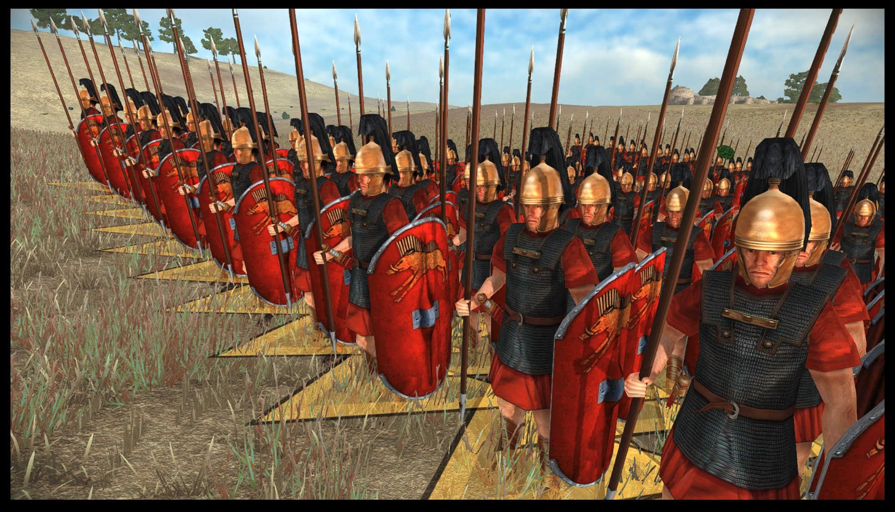

# Importing Rome Total War units to Total War: ROME REMASTERED

## Table Of Contents

* [Summary](#summary)
* [EDU](#edu)
* [DMB](#dmb)
* [CAS files](#cas-files)
* [DDS Textures](#dds-textures)
* [Acknowledgements &amp; Thanks](#acknowledgements--thanks)
   * [Additional tip from the RIS modding team](#additional-tip-from-the-ris-modding-team)


## Introduction

Sometimes you might want to import units from the original Rome Total War into Rome Remastered. If you are starting work on converting a mod from the old game to Remastered this will allow you to get your custom units into the game quickly before you work on any newer higher poly models.

The basic requirements from Rome Total War remain more or less the same and are well summarised [here](http://rtw.heavengames.com/rtw/mods/tutorials/unit_creation/index.shtml).

## Summary

In summary, you’ll need to:

* Assign a unit name and stats through the export_descr_units.txt (EDU) file
* Assign the model and skin using descr_model_battle.txt (DMB)
* Make the unit recruitable in export_descr_buildings.txt (EDB)
* Add a description (export_units.txt)
* Add unit cards (through the UI folders)

The good news is that you can very easily import a whole unit roster into Remastered with very few changes. See the image below for an example of a converted unit in game.



## EDU

The EDU entry can be left unchanged from RTW code. For example, this triarii code would work equally well in the original game. Note that this removes any unit variation as there is no ethnicity coding:

```
; COMMENTS              	Triarii / roman_triarii / Start exp: 0
type						roman triarii
dictionary					roman_triarii
category					infantry
class						spearmen
voice_type					Medium_1
soldier						roman_triarii, 50, 0, 1.41
officer						roman_early_centurion
officer						roman_signifier
attributes					sea_faring, hide_forest, can_sap, very_hardy
formation					1, 1, 2, 2, 5, square
stat_health					1, 5
stat_pri					13, 13, no, 0, 0, melee, blade, piercing, spear, 25, 0.48
stat_pri_attr				light_spear, spear_bonus_6
stat_sec					14, 12, no, 0, 0, melee, blade, piercing, sword, 25, 0.5
stat_sec_attr				no
stat_pri_armour				15, 30, 12, metal
stat_sec_armour				0, 0, flesh
stat_heat					2
stat_ground					0, 0, -2, -1
stat_mental					22, disciplined, highly_trained
stat_charge_dist			30
stat_fire_delay				0
stat_food					60, 300
stat_cost					1, 1401, 385, 58, 499, 1051
ownership					romans_julii, slave
```

## DMB

The DMB code will require some changes.

Here is the file in the original game:

```
type 						roman_triarii
skeleton 					fs_slow_spearman, fs_s1_slow_gladius			
indiv_range					40
texture	 					romans_julii, data/models_unit/textures/romans/triarii_roman.tga
texture 					merc, data/models_unit/textures/romans/triarii_allied.tga
model_flexi 				data/models_unit/triarii_high.cas, max
model_sprite				50.0, data/sprites/RS_roman_triarii_sprite.spr
model_sprite				romans_julii, 50.0, data/sprites/RS_romans_brutii_roman_triarii_sprite.spr
model_sprite				merc, 50.0, data/sprites/RS_roman_triarii_sprite.spr
model_tri 					400, 0.5f, 0.5f, 0.5f
```

…and in Remastered:
```
type roman_triarii
skeleton			fs_slow_spearman										; combat spear
pbr_texture data/characters/textures/generic_pbr.tga
texture data/characters/textures/triarii_allied.tga  ;triarii_roman.tga
texture romans_brutii, data/characters/textures/triarii_allied.tga
texture romans_scipii, data/characters/textures/triarii_allied.tga
texture romans_senate, data/characters/textures/triarii_allied.tga
model_flexi_m data/characters/test_triarii_high_lod0.cas, 15 ;RS2_unit
model_flexi data/characters/test_triarii_high_lod0.cas, max ;RS2_unit
no_variation model_flexi_m data/characters/test_triarii_high_lod0.cas, 15 ;RS2_unit
no_variation model_flexi data/characters/test_triarii_high_lod0.cas, max ;RS2_unit
```

Five changes to note:

1. There is no `indiv_range` line
2. Each unit has to have a PBR (physically based rendering) texture otherwise the game will crash. However, to speed up the importing process you can use a mid grey (RGB 128, 128, 128) texture file. This smooths the shading on the model surfaces. You can use the grey pbr texture [here](/documentation/techart_guides/images/generic_pbr.tga.dds).
3. You will need a minimum of 4 model lines per unit. You need to define at least two levels of detail (even though the mesh model used can be the same for both levels of detail) for both the unit variation and no unit variation game settings.
4. There are no sprite lines
5. Models are now in the `characters` folder rather than `models` unit. Make sure that you put your models here, although this is not absolutely essential, as long as the code defines the right location for your models and textures

## CAS files

You can use the same cas files from the original game without any edits. Just place them in the correct location.

However this should work with cas models from any original game mod.

## DDS Textures

You will need to update the textures, however this is also an easy process. You need to upscale the textures to 2048x2048 and then save them out as a dds texture (dds-lz4). You can do this using the free open source tool [GNU Image Manipulation Program](https://www.gimp.org/downloads/).

You can use the Example texture [here](/documentation/techart_guides/images/generic_pbr.tga.dds) as a reference.

**NOTE 1:** If you have higher resolution version of the assets from your original creation process you'll get a better results than upscaling. The example used on this page benefitted from higher quality assets that help teke advantage of ROME REMASTERED's improved renderer.

**NOTE 2:** To speed up the importing process you can use a mid grey (RGB 128, 128, 128) texture file for the PBR file. This smooths the shading on the model surfaces when importing original game units. Feel free to use the texture [here](/documentation/techart_guides/images/generic_pbr.tga.dds).

## Acknowledgements & Thanks

This guide was created with the assistance of Tone from the RIS modding team. He has used this method to import 100s of models from the original game format into Rome Remastered as part of their mod and we have used their experiences as a basis for this guide.

You can check out their mod on the Steam Workshop [here](https://steamcommunity.com/sharedfiles/filedetails/?id=2487698001).

### Additional tip from the RIS modding team

For RTR Imperium Surrectum (RIS), we have made extensive use of Sublime, a fantastic text editor which allows multi-line text editing, meaning that you can potentially edit all your DMB entries at once without having to go through hundreds of units one by one.

The process for editing the DMB is as follows:

1. Highlight a section of text on the line that you want to change that is repeated in each model
e.g.in this example we are editing the unit model line
model_flexi data/models_unit/triarii_high.cas, max
and we only have a single model line for every unit in the old DMB:
 * highlight a unique element in that line – you could use “model_flexi” or “.cas”. Let’s choose “model_flexi”

2. Hold down CTRL+D until that equivalent line is selected for that equivalent code line in every model.
This activates multi-line editing
 * You should now see “model_flexi” selected for every unit
 * press “Home” (you may need to do this more than once if your lines are long and there is wrapping)
 * the cursor is now at the start of every line you’re going to edit (you can now navigate around using Home, End, Up, Down, Left and Right controls).

3. Hold down shift and then “End” and you will see that the entire line is highlighted. Copy the line using CTRL+C
4. Hit “Home”, then “Return” – you will now have created a whole bunch of new lines above each unit’s model_flexi line.
5. Paste using CTRL+V.
6. Hit the “Home” key, so the cursor is now at the start of each copied line, then, the “Right” key until the cursor is at the end “model_flexi” – now type “_m”, so these lines now all start with “model_flexi_m”
7. Now hit the “End” key and backspace to remove “max” and replace with “15”.
8. Repeat this process for the “no_variation” lines using a combination of Home, End, Up, Down, left and Right keys together with holding down the Shift key in order to highlight parts of the line where needed.
9. Repeat for the indiv_range line, replacing with the required PBR code.

Welcome to the power of multiline editing!
